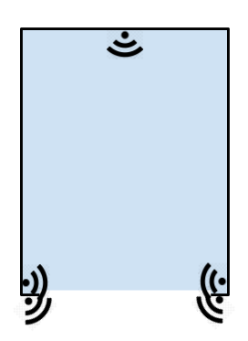
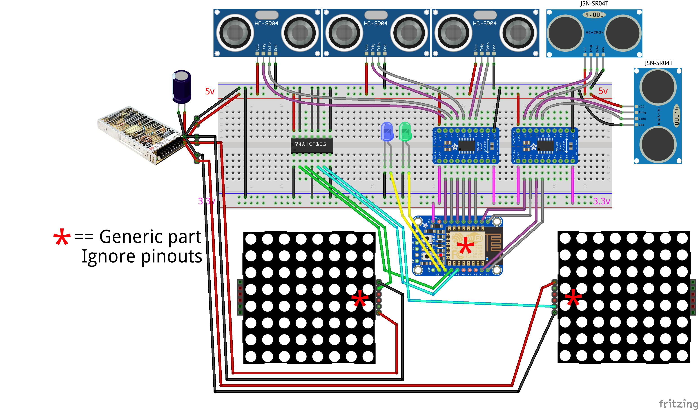
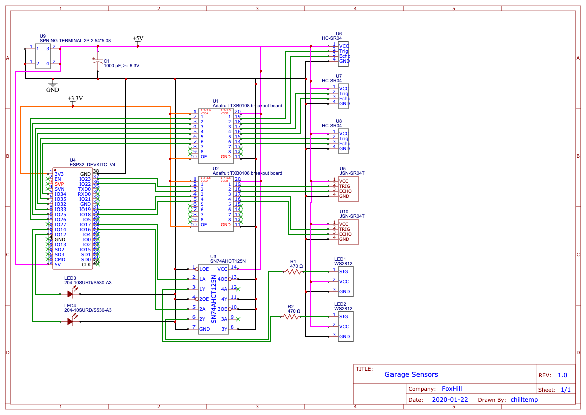
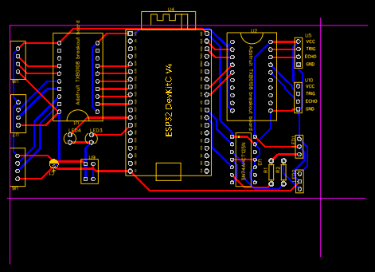

# Garage Parking Sensors
Why? Our garage doors are small.  The plan is to use sensors and a LED panel to show how centered the car is in relation to the door.

:warning:	WARNING: I'm not an expert!  I learning as I go :fire:

## The Sensors

* 2 - 4 sensors at the door
* 1 sensor at the far end
* Actual number and placement of sensors is to be determined
* It's probable that the sensors will interfere with each other in my planned layout

## Parts
(Full parts list TBD)
* 5V 200W Power Supply [link](https://www.digikey.com/product-detail/en/LRS-200-5/1866-3337-ND/7705029/?itemSeq=315016646)
  * Min 153.6W needed for the LEDs
* WS2812B RGB 16x16 Pixel Panel [link](https://www.aliexpress.com/item/4000544411175.html?spm=a2g0s.9042311.0.0.17694c4djT6thW)
  * Qty 2
  * 0.3W/pixel * 256 = 76.8W max per panel
* ESP32-DevKitC [link](https://www.aliexpress.com/item/4000093185394.html?spm=a2g0s.9042311.0.0.17694c4djT6thW)
  * 5V IN
  * Data lines are 3.3V
* HC-SR04 and/or JSN-SR04T Ultrasonic distance sensor
  * Qty 5 total
  * Regular & waterproof versions
  * Pinouts are the same, but different code required
* TXS0108E Logic Level Converter 3.3V <==> 5V
  * 8 Channel, bi-directional
  * Not recommended for LEDs
  * Output Enable uses 3.3V
  * ??? Should I add a pull-down resistor to OE? If so, size?
* 74AHCT125 Logic Level Converter 3.3V ==> 5V
  * 4 Channel, uni-directional
  * Good with LEDs
  * Output Enable uses GND
  * Must GND unused OE & Y pins
  * ??? Should I add a pull-up resistor to OE? If so, size?

### Misc
* capacitor (1000 µF, 6.3V or higher) across the + and – as recommended by the [Adafruit NeoPixel Überguide](https://learn.adafruit.com/adafruit-neopixel-uberguide/best-practices)
* 2x single color LEDs for status / debugging
* Spring Terminal Blocks 
  * For data [link](https://www.adafruit.com/product/1081)
  * For power [link](https://www.digikey.com/product-detail/en/2834085-1/A124215-ND/6012662/?itemSeq=315265240)

## Breadboard

## Schematic

## PCB

* Need to replace the PCB masks for the LED Panels and Sensors with layouts for Spring Terminal Blocks 
